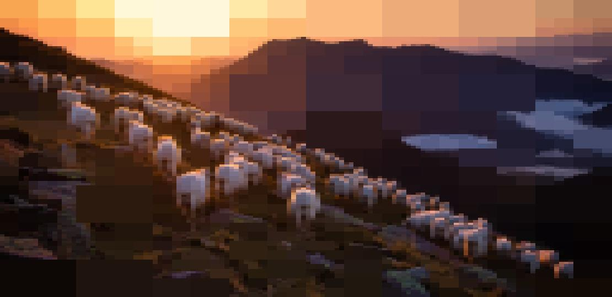

# Image Compression using Quadtrees

Algorithm in progress                |  Output
:-----------------------------------:|:------------------------------------:
  |  

This program will compress an image using the quadtree datastructure. This works by recursively splitting the image into quadrants if it stays under a given depth level or is too 'detailed'. Each quadrant holds data about the detail and the colour of the quadrant in order for us to form an image after we have created the quadtree structure using the image.

With help from: [@tanneryork](https://github.com/tanneryork)

___Here's a showreel highlighting the beauty of it.___

Algorithm in progress                |  Output
:-----------------------------------:|:------------------------------------:
    |  

Algorithm in progress                |  Output
:-----------------------------------:|:------------------------------------:
    |  

Algorithm in progress                |  Output
:-----------------------------------:|:------------------------------------:
       |  

Before

After

